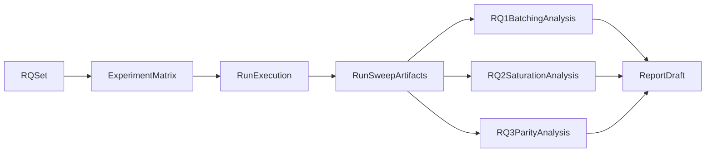

# ML Systems Report Methodology Blueprint

## Scope and Framing

- Anchor the report around the three RQs as primary sections: batching effects, saturation threshold, and custom-vs-vLLM parity comparison.
- Treat this workspace as a two-system benchmark harness (client loadgen/analysis + server runtime/scheduling) and preserve boundary attribution in all claims.
- Use canonical definitions and contracts from:
  - [Metrics semantics](/home/garuc/projects/LLMQueueBenchmark/docs/principles/metrics-semantics.md)
  - [Artifact contract](/home/garuc/projects/LLMQueueBenchmark/docs/principles/artifact-contract.md)
  - [Run/sweep artifact schema](/home/garuc/projects/LLMQueueBenchmark/docs/data-models/run-artifacts.md)
  - [Benchmark recipes](/home/garuc/projects/LLMQueueBenchmark/docs/operations/benchmark-recipes.md)

## RQ-to-Experiment Mapping

- **RQ1: Batching strategy vs latency/throughput**
  - Compare server configs: `custom+naive`, `custom+dynamic`, `vllm`.
  - Hold constant: model ID, tokenizer, max tokens, workload source, seed policy, hardware, telemetry polling interval.
  - Outputs: run-level latency distributions (TTFT/TPOT/total), throughput time-series, queue/batch telemetry where available.
- **RQ2: Saturation load levels**
  - Run Poisson sweeps over lambda (`--sweep-lambdas`) with repeats (`--sweep-repeats`).
  - Define saturation operationally as first load where throughput flattens while latency (especially p95/p99 TTFT/total) rises superlinearly.
  - Outputs: `sweep_raw.csv`, `sweep_summary.csv`, `capacity_curve.png` plus per-lambda diagnostics.
- **RQ3: Custom scheduler vs vLLM under identical workloads**
  - Enforce workload parity: identical prompt set, seed, arrival mode, lambda grid, horizon, concurrency cap.
  - Report both absolute metrics and relative deltas with uncertainty across repeats.
  - Explicitly separate client-derived and server-derived metrics in figures/tables.

## Experimental Design (Conference Style)

- **Independent variables**: runtime/scheduler mode, arrival mode, lambda, concurrency, prompt length profile.
- **Controlled variables**: hardware/GPU, model and tokenizer, software versions, max token cap, warmup/cooldown policy, scrape interval.
- **Dependent variables**:
  - Client: TTFT, TPOT, total latency, req/s, tok/s.
  - Server: queue length/time, batch size, batch latency, GPU memory/utilization telemetry.
- **Repetitions and statistics**:
  - Minimum 3 repeats per condition (prefer 5 for key claims).
  - Report median + p95/p99 + spread (`std`/IQR where appropriate).
  - Use sweep aggregation artifacts as source-of-truth for cross-load comparisons.

## Execution Protocol

- Use the canonical server/client interfaces and startup paths from:
  - [Server CLI/env contract](/home/garuc/projects/LLMQueueBenchmark/docs/interfaces/server-cli-env.md)
  - [Client CLI contract](/home/garuc/projects/LLMQueueBenchmark/docs/interfaces/client-cli.md)
  - [Local dev runbook](/home/garuc/projects/LLMQueueBenchmark/docs/operations/local-dev.md)
- Protocol sequence per condition:
  1. Start server mode under test and verify `/health` + `/v1/models`.
  2. Execute benchmark run or sweep with explicit `--outdir` and fixed config manifest.
  3. Validate expected artifacts against schema contract.
  4. Archive config + artifacts for traceability.
- For vLLM fairness on heterogeneous GPUs, select documented dtype/memory profiles from [vLLM GPU settings](/home/garuc/projects/LLMQueueBenchmark/docs/operations/vllm-gpu-settings.md) and state chosen profile in the paper.

## Analysis and Reporting Structure

- **Section 1 (RQ1)**: Strategy comparison at matched loads.
  - Tables: p50/p95/p99 TTFT/total latency, achieved throughput.
  - Figures: throughput-latency curves, queue/batch telemetry overlays.
- **Section 2 (RQ2)**: Saturation characterization.
  - Capacity curve and knee-point narrative using sweep summaries.
  - Per-lambda failure/error-rate context from request-level artifacts.
- **Section 3 (RQ3)**: Custom vs vLLM parity study.
  - Paired-condition deltas and confidence/variance commentary.
  - Separate “performance” from “operational constraints” (startup stability, GPU compatibility flags).
- **Threats to validity**:
  - Clock-domain separation (client vs server timelines), telemetry availability differences, stochastic Poisson variance, model/hardware external validity limits.

## Agent-Orchestrated Workflow

- Agent A: execute benchmark matrix and collect artifacts.
- Agent B: validate artifact completeness/contract compliance.
- Agent C: compute RQ-specific aggregations and draft figure/table assets.
- Agent D: write interpretation with strict metric attribution labels.

## Acceptance Criteria for the Report Plan

- Every claim maps to a canonical artifact file and metric owner.
- All cross-mode comparisons use matched workload/load settings.
- Saturation claims are backed by sweep-level trends and repeat variability.
- Custom-vs-vLLM conclusions include both central tendency and variance, with hardware/profile disclosures.

